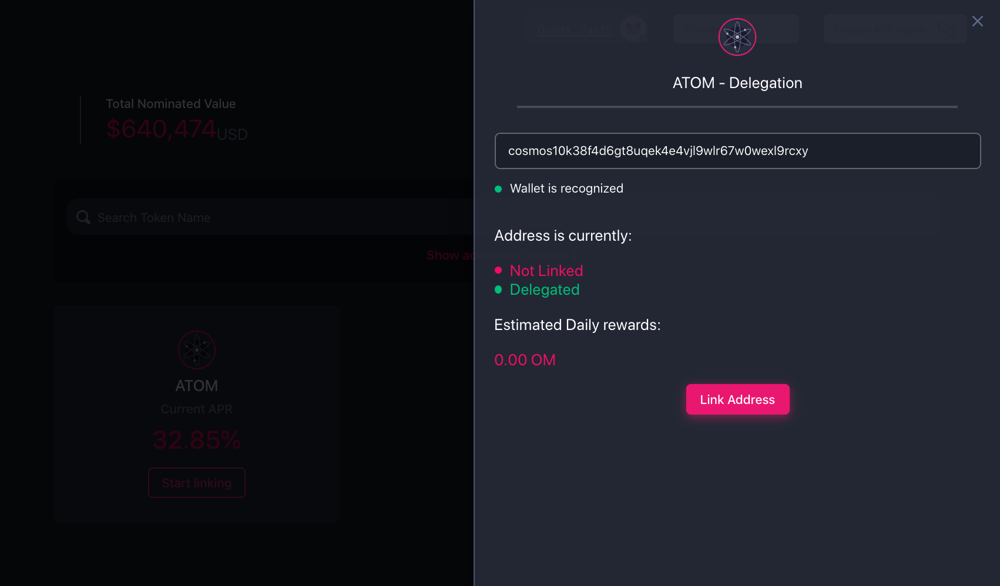

Navigate to the delegator rewards section of the MANTRA DAO web app. https://app.mantradao.com/delegator

Press the 'Start linking' button on your chosen delegator rewards asset.

You will need to be on the Binance Smart Chain network in your Ethereum wallet and have BNB to complete the cross chain linking proccess. You will also need a fractional amount of the native currecny of the linking chain (in the case ATOM, you need around 0.01 ATOM).

Enter your address on the chosen network that is delegating to a MANTRA DAO validator node.

Click the 'Link address' button

If the linking details are correct, click the 'Link Addresses button' to confirm your link.

From the same address that you are linking and that is delegating to the MANTRA DAO node, send the exact amount of the native asset specified. This proccess helps MANTRA DAO know you are the controller of this wallet.

With your wallet set to the Binance Smart Chain network, complete the final linking transaction, this final link will help you get your OM rewards later.

Congratulations, you are linked!

