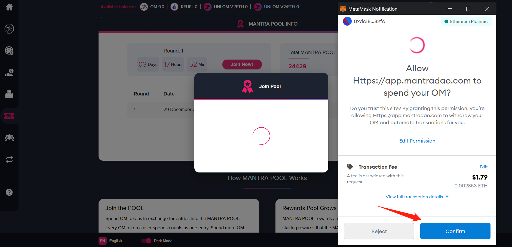

## What is MANTRA POOL?

### A decentralized lottery

Matra Pool is a decentralized lottery powered by OM tokens.

Each week five lucky users who contributed OM to the pool will win prize tokens.

The more OM a user contributes to the pool, the higher their chance of winning. 

### More than just a lottery

Whether you win or not, all MANTRA POOL participants win because they are helping to reduce the amount of circulating OM.

Soon contributing OM will also earn you KARMA. As members earn more KARMA they unlock KARMA rewards, including weekly free entry into all MANTRA POOLs and other benefits.

### Where do Rewards Come From?

Twenty five percent of all staking rewards from MANTRA DAO Foundation staked assets and validator nodes goes into MANTRA POOL. Occasionally additional rewards will be offered by MANTRA DAO partner projects, so you never know what you might win in addition to normal rewards! 

## How to join MANTRA POOL

### Connect Wallet

Navigate to the [MANTRA POOL app](https://app.mantradao.com/mantra-pool) page and connect your Ethereum wallet.

Click "Connect to a Wallet" and connect your wallet of choice.

### View Dashboard

Now that you've connected your wallet, you can view your information from the main dashboard. Here you can view the total pool entries, your own entries, and click "View" to see detailed information about each round.

Click "Join Now!" to join the pool.

### Buy Entries

In the pop-up window, enter the amount of OM tokens you would like to contribute to the pool and then click "Next" to continue.

### Confirm Details

Click "Confirm" to confirm your transaction details. A new window will pop up for the "Allow" transaction.

### Make "Allow" Transaction

Click "Confirm" to make the transaction to allow MANTRA DAO to spend your OM.  

Wait for the transaction to complete on chain. This may take several minutes or longer depending on network conditions. You can check by viewing your address on E[therscan](https://etherscan.io/).

### Make Join Pool Transaction

Once the "Allow" transaction has completed, a new window will pop up for a new transaction. Click "Confirm" to make the transaction to join MANTRA POOL.  

Wait for the transaction to complete on chain.  

### Transaction Complete

Once the transaction has completed, a pop up will appear showing the transaction was successful.

Congratulations, you've just joined the MANTRA POOL!

