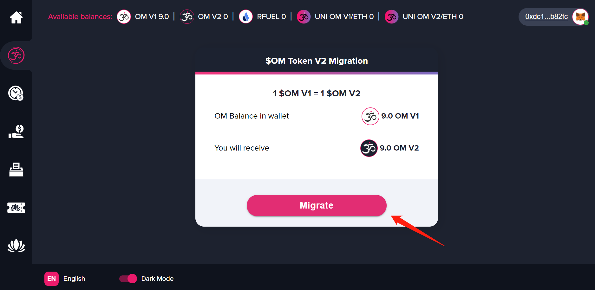
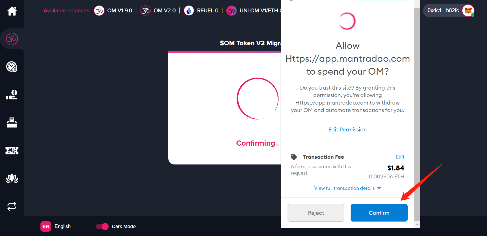
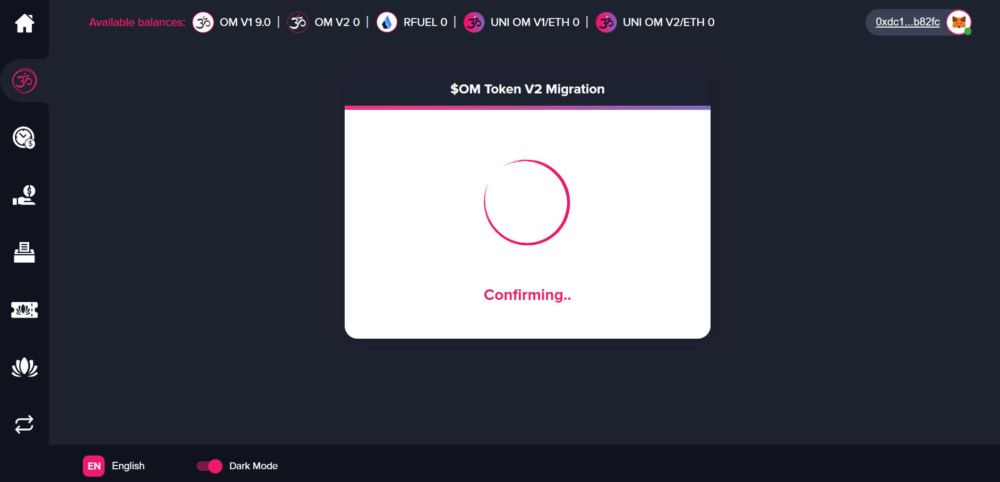
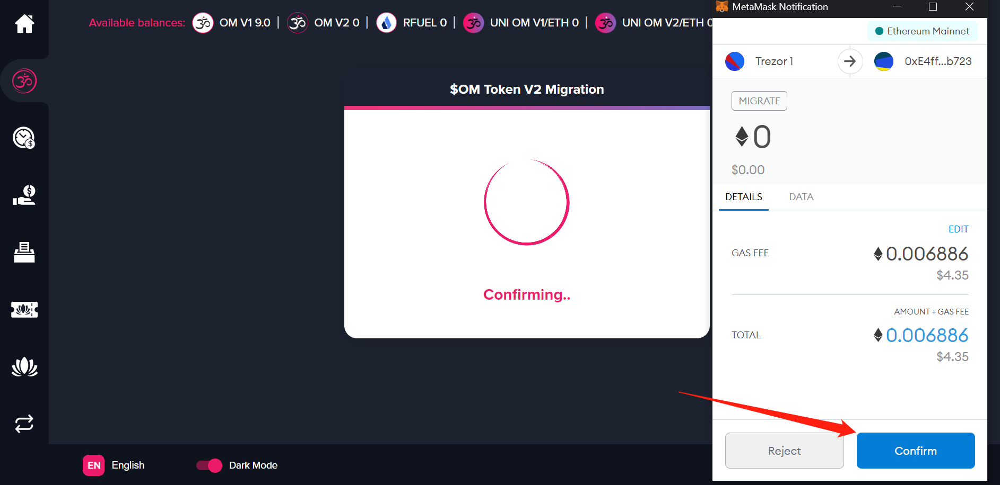
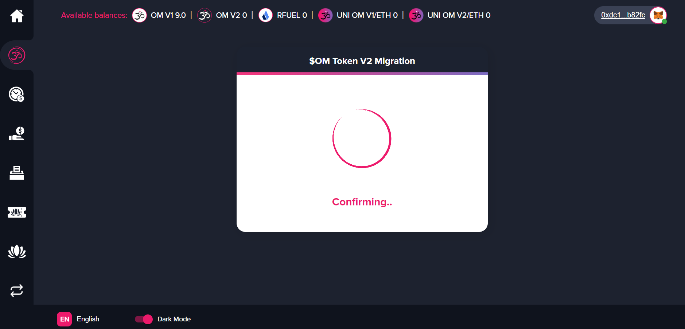

## What is OM v2

OM v2 is the second version of the OM Token. It features important updates such as setting the maximum supply at 888,888,888 OM. It's easy to migrate your OM v1 tokens to OM v2. Just follow the step by step instructions below.

## How to Migrate to OM v2

### Open Migration App

Navigate to the [migration app](https://app.mantradao.com/om-token-migration) on the official MANTRA DAO app page.

If you haven't already, connect your wallet by clicking "Connect to a wallet" on the top right, and make sure you have your address which contains your OM v1 tokens selected.

Click "Migrate" to begin the migration.

### Make "Allow" Transaction

Click "Confirm" to complete the first transaction. This transaction allows the MANTRA DAO app to operate on your OM v1 tokens. 

*This example uses MetaMask. The process will vary slightly with different wallets.*

### Wait for Transaction

Wait for the "Allow" transaction to complete. You can view your address on [Etherscan](https://etherscan.io/) in order to see the status of your transaction.

### Make "Migrate" Transaction

Once the "Allow" transaction has completed, you will be prompted to make the "Migrate" transaction. This transaction will exchange your OM v1 tokens for OM v2. 

### Wait for Transaction

Wait for the second transaction to finish and complete the migration process.

### Transaction Complete

Once the transaction has completed, you will a green success message pop up as in the screenshot below. Congratulations, you have completed the OM v2 token migration!

