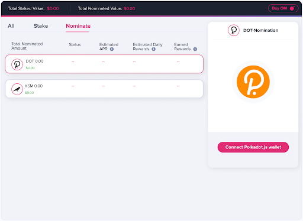
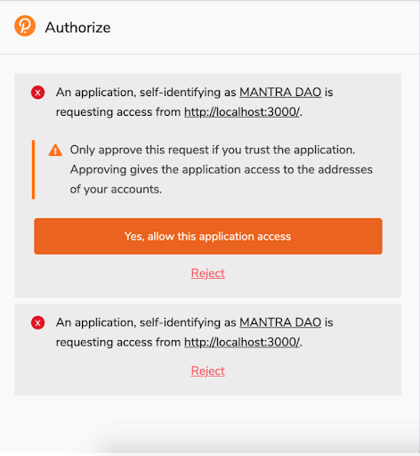
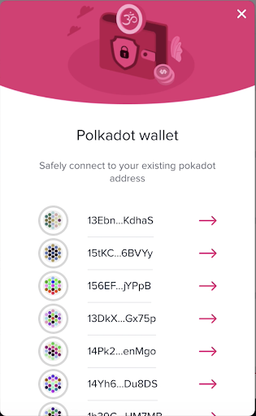
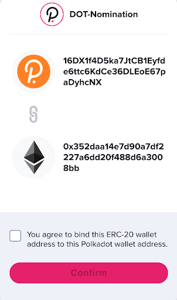
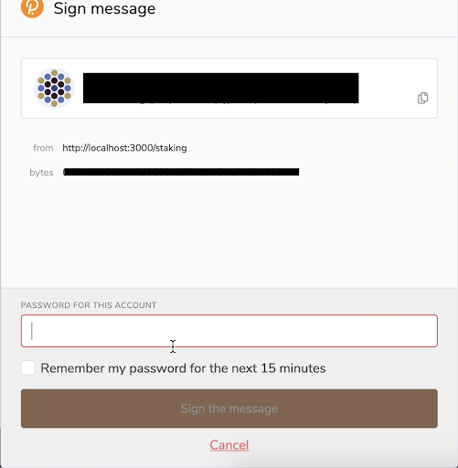
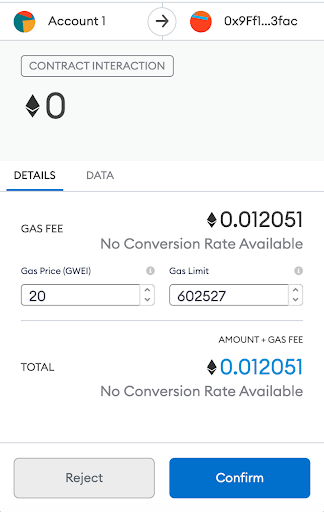
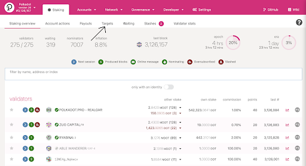
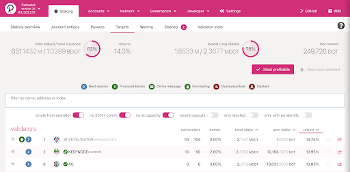
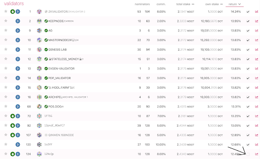

#### How to Stake Polkadot (DOT) with MANTRA DAO and Earn Enhanced Rewards

Since the start of MANTRA DAO, we have been building our platform and products with the goal of supporting the Polkadot and Parity ecosystems helping them to bridge DeFi services across different blockchains and services. We are happy to launch our enhanced OM rewards program through DOT nomination. While we understand the nomination process for DOT can be a bit confusing at first, we want to help outline the step-by-step process for how to nominate your DOT to the MANTRA DAO validator, and then bind your ERC-20 wallet to be able to receive your OM rewards. This program is only available for people who stake directly through Polkadot and does not work for those that are staking their DOT on centralized exchanges.

1. On the MANTRA DAO app you must first connect your polkadot.js wallet (if you don’t already have a polkadot.js web wallet, you can create directly on their interface [here](https://polkadot.js.org/apps/?rpc=wss%3A%2F%2Frpc.polkadot.io#/accounts)).

Allow the the application access to see the addresses of your accounts

:::warning

Rejecting this popup will require you to restart your entire browser (issue in polkadot.js wallet)

:::

2. In order to connect your polkadot.js wallet you must first authorize it to connect and interact with the MANTRA DAO app. Choose the DOT wallet you will use to nominate your DOT to the MANTRA DAO validator:

3. Next you will need to bind your polkadot.js wallet to your connected ERC-20 wallet. This ERC-20 wallet is the one you will be receiving your enhanced OM rewards to. In order to bind this you will need to approve from your polkadot.js wallet which will generate a popup once you click Confirm.

4. To bind the two addresses together you will need to sign the message on polkadot.js
 

Simply accept the ethereum wallet transaction.

5. Next you will need to Nominate your DOT to MANTRA DAO if you have not already. If you have not yet, click Nominate in Polkadot, which will redirect you to the polkadot.js interface.

6. Once you are in the polkadot.js web interface for staking, you will need to go to the Targets tab:

7. Once you are in the Targets tab, you should press Most Profitable, which will use the Polkadot generated algorithm that selects the 16 best performing validators: 

8. Once you click Most Profitable, you will see check boxes with ticks next to them on the right hand side of the frame. If MANTRA DAO is not one of the 16 selected validators, you will need to unselect the last ticked box so that it opens up room for adding the MANTRA DAO validator.

9. After you untick the last selected box, you can type in MANTRA DAO in the search bar so that you can easily locate the validator to nominate to (please make sure that you don’t have any of the search preferences ticked so that it shows all search results when you type in MANTRA DAO):

10. With MANTRA DAO validator pulled up, click on the box to the right side to select it as one of the validators you are nominating your DOT to:

11. Once you have selected MANTRA DAO,  click Nominate Now to execute the transaction and begin nominating:

12. A popup frame will appear on polkadot.js to approve you accounts and Nominate

13. Once you have successfully nominated to the MANTRA DAO validator, you will see in the MANTRA DAO app that you are currently nominating and you will be able to see the OM rewards that you have generated!

